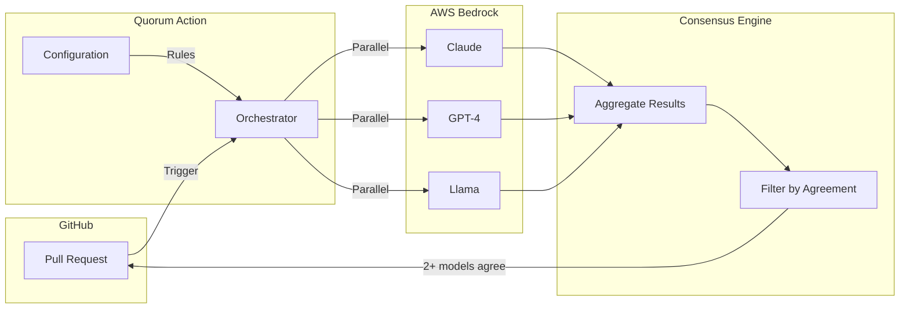

# Quorum Action

[](https://github.com/eze-godoy/quorum-action/actions/workflows/ci.yml)
[](https://opensource.org/licenses/MIT)

AI-powered code review using AWS Bedrock with multi-model consensus. Runs PRs through Claude, GPT-4 & Llama — only surfaces issues where 2+ models agree, reducing noise and false positives.

## Features

- **Multi-Model Consensus**: Reviews code with multiple AI models and filters issues by agreement threshold
- **AWS Bedrock Integration**: Secure, serverless AI inference with OIDC authentication
- **Configurable Review Depth**: Quick, standard, deep, or security-focused reviews
- **Path-Based Rules**: Different review settings for different parts of your codebase
- **GitHub Native**: Inline PR comments with actionable suggestions

## Quick Start

### 1. Deploy AWS Infrastructure

First, deploy the [terraform-aws-quorum](https://github.com/eze-godoy/terraform-aws-quorum) module to set up OIDC authentication and Bedrock permissions:

```hcl
module "quorum" {
  source = "github.com/eze-godoy/terraform-aws-quorum"

  github_org  = "your-org"
  github_repo = "your-repo"
}
```

### 2. Add the Workflow

Create `.github/workflows/quorum.yml`:

```yaml
name: Quorum Code Review

on:
  pull_request:
    types: [opened, synchronize]

permissions:
  contents: read
  pull-requests: write
  id-token: write

jobs:
  review:
    runs-on: ubuntu-latest
    steps:
      - uses: actions/checkout@v4

      - name: Quorum Code Review
        uses: eze-godoy/quorum-action@v1
        with:
          aws-role-arn: ${{ secrets.AWS_ROLE_ARN }}
```

### 3. Configure (Optional)

Create `.quorum.yaml` in your repository root:

```yaml
version: 1

review:
  depth: standard
  focus:
    - security
    - performance

ignore:
  - '**/*.test.ts'
  - '**/fixtures/**'

paths:
  - pattern: 'src/auth/**'
    depth: security
```

## Inputs

| Input | Description | Required | Default |
|-------|-------------|----------|---------|
| `aws-role-arn` | AWS IAM Role ARN for OIDC authentication | Yes | - |
| `aws-region` | AWS region for Bedrock | No | `us-east-1` |
| `model` | Bedrock model ID | No | `anthropic.claude-3-5-sonnet-20241022-v2:0` |
| `config-path` | Path to `.quorum.yaml` | No | `.quorum.yaml` |
| `review-depth` | Review depth profile | No | `standard` |
| `fail-on-errors` | Fail if critical issues found | No | `false` |

## Outputs

| Output | Description |
|--------|-------------|
| `review-summary` | Summary of the review results |
| `issues-found` | Number of issues identified |
| `cost-usd` | Estimated cost of the review |

## Review Depth Profiles

| Profile | Use Case | Focus Areas |
|---------|----------|-------------|
| `quick` | Fast feedback on small changes | Obvious issues, syntax errors |
| `standard` | Balanced review (default) | Code quality, best practices |
| `deep` | Thorough analysis | Architecture, edge cases, testing |
| `security` | Security-focused | OWASP Top 10, auth, input validation |

## Architecture



## Related Projects

- [terraform-aws-quorum](https://github.com/eze-godoy/terraform-aws-quorum) - Terraform module for AWS infrastructure

## Development

```bash
# Install dependencies
pnpm install

# Run tests
pnpm test

# Lint and format
pnpm run check

# Build
pnpm run build
```

## License

MIT
