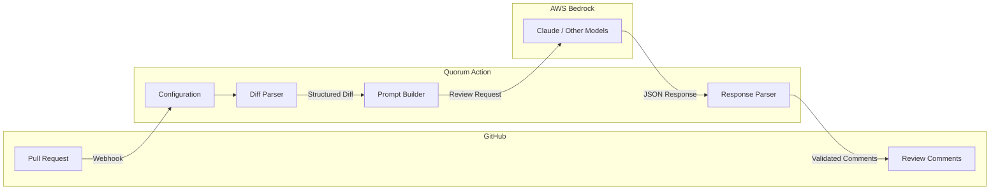

# Quorum Action

[](https://github.com/eze-godoy/quorum-action/actions/workflows/ci.yml)
[](https://opensource.org/licenses/MIT)

AI-powered code review using AWS Bedrock. Get intelligent, actionable feedback on your pull requests with configurable review depth, security-focused analysis, and inline suggestions.

## Features

- **AWS Bedrock Integration**: Secure, serverless AI inference with OIDC authentication
- **Configurable Review Depth**: Quick, standard, deep, or security-focused reviews
- **Path-Based Rules**: Different review settings for different parts of your codebase
- **PR Config Override**: Override settings per-PR via description comments
- **GitHub Native**: Inline PR comments with actionable suggestions
- **Cost Tracking**: Monitor AI usage costs per review

## Quick Start

### 1. Deploy AWS Infrastructure

First, deploy the [terraform-aws-quorum](https://github.com/eze-godoy/terraform-aws-quorum) module to set up OIDC authentication and Bedrock permissions:

```hcl
module "quorum" {
  source = "github.com/eze-godoy/terraform-aws-quorum"

  github_org  = "your-org"
  github_repo = "your-repo"
}
```

### 2. Add the Workflow

Create `.github/workflows/quorum.yml`:

```yaml
name: Quorum Code Review

on:
  pull_request:
    types: [opened, synchronize]

permissions:
  contents: read
  pull-requests: write
  id-token: write

jobs:
  review:
    runs-on: ubuntu-latest
    steps:
      - uses: actions/checkout@v4

      - name: Configure AWS credentials
        uses: aws-actions/configure-aws-credentials@v4
        with:
          role-to-assume: ${{ secrets.AWS_ROLE_ARN }}
          aws-region: us-east-1

      - name: Quorum Code Review
        uses: eze-godoy/quorum-action@v1
        with:
          aws-role-arn: ${{ secrets.AWS_ROLE_ARN }}
```

### 3. Configure (Optional)

Create `.quorum.yaml` in your repository root:

```yaml
version: 1

review:
  depth: standard        # quick | standard | deep | security
  focus:
    - security
    - best-practices
  instructions: |
    Focus on TypeScript best practices.
    Pay attention to error handling.

ignore:
  - '**/*.test.ts'
  - '**/fixtures/**'
  - '**/*.md'

paths:
  - pattern: 'src/auth/**'
    depth: security
    instructions: 'Extra security scrutiny for auth code'
  - pattern: 'tests/**'
    depth: quick

model:
  id: anthropic.claude-sonnet-4-20250514-v1:0
  maxTokens: 4096
  temperature: 0.3

pricing:
  inputPer1M: 3.0
  outputPer1M: 15.0
```

## Inputs

| Input | Description | Required | Default |
|-------|-------------|----------|---------|
| `aws-role-arn` | AWS IAM Role ARN for OIDC authentication | Yes | - |
| `aws-region` | AWS region for Bedrock | No | `us-east-1` |
| `model` | Bedrock model ID | No | `anthropic.claude-sonnet-4-20250514-v1:0` |
| `config-path` | Path to `.quorum.yaml` | No | `.quorum.yaml` |
| `github-token` | GitHub token for API access | No | `${{ github.token }}` |
| `review-depth` | Review depth profile | No | `standard` |
| `fail-on-errors` | Fail if critical/high issues found | No | `false` |
| `dry-run` | Run without posting comments | No | `false` |

## Outputs

| Output | Description |
|--------|-------------|
| `review-summary` | Summary of the review results |
| `issues-found` | Number of issues identified |
| `cost-usd` | Estimated cost of the review |

## Review Depth Profiles

| Profile | Use Case | Focus Areas |
|---------|----------|-------------|
| `quick` | Fast feedback on small changes | Critical bugs, obvious issues |
| `standard` | Balanced review (default) | Code quality, best practices, basic security |
| `deep` | Thorough analysis | Architecture, edge cases, DRY, testing gaps |
| `security` | Security-focused | OWASP Top 10, auth, input validation, secrets |

## PR Description Config Override

Override `.quorum.yaml` settings for a specific PR by adding a config comment in the PR description:

```markdown
## Summary
Major refactor of authentication system

<!-- quorum-config: {"review": {"depth": "security", "focus": ["security"]}} -->
```

### Supported Overrides

- `review.depth` - Change review depth
- `review.focus` - Add focus areas (concatenated with existing)
- `review.instructions` - Override custom instructions
- `ignore` - Add ignore patterns (concatenated with existing)
- `paths` - Add path rules (concatenated with existing)
- `model.*` - Override model settings

## Configuration Reference

### Review Settings

```yaml
review:
  depth: standard          # Review thoroughness
  focus:                   # Areas to emphasize
    - security
    - performance
    - best-practices
  instructions: |          # Custom instructions for the AI
    Focus on error handling and edge cases.
```

### Ignore Patterns

```yaml
ignore:
  - '**/node_modules/**'   # Dependencies
  - '**/dist/**'           # Build output
  - '**/*.min.js'          # Minified files
  - '**/package-lock.json' # Lock files
```

Default ignore patterns are always included:
- `**/node_modules/**`, `**/dist/**`, `**/build/**`
- `**/.git/**`, `**/coverage/**`
- `**/*.min.js`, `**/*.min.css`
- `**/package-lock.json`, `**/pnpm-lock.yaml`, `**/yarn.lock`

### Path-Based Rules

```yaml
paths:
  - pattern: 'src/api/**'
    depth: deep
    instructions: 'Check for proper error handling and validation'

  - pattern: 'src/auth/**'
    depth: security
    instructions: 'Security-critical code, check for vulnerabilities'

  - pattern: '**/*.test.ts'
    depth: quick
```

### Model Configuration

```yaml
model:
  id: anthropic.claude-sonnet-4-20250514-v1:0  # Bedrock model ID
  maxTokens: 4096                               # Max response tokens
  temperature: 0.3                              # Response randomness (0-1)

pricing:
  inputPer1M: 3.0    # Cost per 1M input tokens (USD)
  outputPer1M: 15.0  # Cost per 1M output tokens (USD)
```

## Architecture



## Supported Models

Any model available in AWS Bedrock can be used. Popular options:

| Model | Model ID | Notes |
|-------|----------|-------|
| Claude Sonnet 4 | `anthropic.claude-sonnet-4-20250514-v1:0` | Default, best balance |
| Claude Haiku | `anthropic.claude-3-haiku-20240307-v1:0` | Faster, lower cost |
| Claude Opus | `anthropic.claude-3-opus-20240229-v1:0` | Most capable |

Note: Newer Claude models (4.x+) automatically use cross-region inference profiles.

## Coming Soon

- **Multi-Model Consensus**: Review with multiple AI models and surface only issues where 2+ models agree
- **Agreement Threshold**: Configure minimum model agreement for comments
- **Custom Severity Mapping**: Map issue categories to custom severity levels
- **Review Templates**: Pre-built review configurations for common frameworks

## Related Projects

- [terraform-aws-quorum](https://github.com/eze-godoy/terraform-aws-quorum) - Terraform module for AWS infrastructure

## Development

```bash
# Install dependencies
pnpm install

# Run tests
pnpm test

# Lint and format
pnpm run check

# Build
pnpm run build
```

## License

MIT
